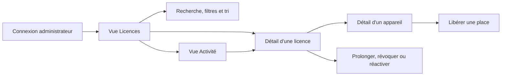

# Copro Auto — Dashboard administrateur v2

## Contrôle

- Version : `UX v2 — 29/08/2026`
- Statut : `implémenté localement et vérifié le 29/08/2026`
- Acteur : administrateur unique de Copro Auto
- Plateforme : navigateur moderne, ordinateur en priorité; tablette et téléphone pris en charge
- Langue : français
- Fuseau d'affichage : `Africa/Casablanca`
- Accessibilité cible : WCAG 2.2 AA pour les parcours administratifs critiques
- Base visuelle : conserver le thème clair, la navigation sombre et les couleurs turquoise de l'administration actuelle

## Exigences approuvées

- `REQ-DASH-01` — Toutes les dates affichent la date **et** l'heure au format français, par exemple `29 août 2026 à 14:35`, dans le fuseau Maroc.
- `REQ-DASH-02` — Un appareil expose : nom de l'ordinateur, édition/version Windows, architecture, version Copro Auto, identifiant court, première activation, dernier contact et date de libération éventuelle.
- `REQ-DASH-03` — Le statut d'une place de licence (`Actif` ou `Libéré`) reste distinct de l'état de connexion (`En ligne` ou `Hors ligne`).
- `REQ-DASH-04` — `En ligne` signifie que le dernier contact serveur date de moins de 20 minutes; au-delà, l'appareil est `Hors ligne`. Le texte relatif `il y a …` accompagne toujours la date exacte.
- `REQ-DASH-05` — Le résumé montre les licences valides, les échéances sous 30 jours, les places occupées, les appareils en ligne et les versions d'application obsolètes.
- `REQ-DASH-06` — Les licences peuvent être recherchées, filtrées par statut/type/échéance/activité et triées.
- `REQ-DASH-07` — L'activité indique l'action, le client, l'appareil concerné et sa date/heure exacte.
- `REQ-DASH-08` — Aucun numéro de série, adresse MAC, adresse IP complète ou géolocalisation n'est collecté ni affiché.
- `REQ-ACT-01` — L'activité est paginée côté serveur, du plus récent au plus ancien, par 25 événements par défaut avec options 25, 50 et 100.
- `REQ-ACT-02` — La pagination reste stable lorsque de nouveaux événements arrivent : elle utilise un curseur `(created_at, id)` et non un simple décalage fragile.
- `REQ-ACT-03` — L'administrateur peut rechercher un client/appareil et filtrer par période, catégorie et origine de l'action.
- `REQ-ACT-04` — Les vérifications automatiques de licence sont regroupées et masquées par défaut afin que les événements importants restent visibles.
- `REQ-ACT-05` — L'administrateur peut exporter en CSV uniquement les événements correspondant aux filtres actifs; aucune clé ou empreinte complète n'est exportée.

## Objets et règles de données

| Objet | Données visibles | Règles |
|---|---|---|
| Licence | client, indice de clé, plan, essai/commerciale, statut, places utilisées/limite, création, échéance | Une licence active peut être `À renouveler` si son échéance est dans 30 jours ou moins. |
| Appareil | nom, Windows/édition/build, architecture, version de l'app, identifiant court, état de place, connexion, activation, dernier contact, libération | Le hash complet reste secret. L'identifiant affiché est limité à 8 caractères et sert seulement au support. |
| Version | version installée et version courante recommandée | La version obsolète est signalée sans bloquer la licence. La version courante provient de la configuration serveur. |
| Événement | type, client, appareil, date/heure | L'historique ne révèle ni clé complète ni empreinte complète. |

Les timestamps restent stockés en UTC côté serveur. Le navigateur les rend systématiquement avec `timeZone: "Africa/Casablanca"`, `dateStyle: "medium"` et `timeStyle: "short"`.

## Architecture de l'information

La navigation principale reste limitée à `Licences` et `Activité`. Le détail s'ouvre dans un panneau latéral sur ordinateur et dans une vue plein écran sur petit écran. Cela préserve le contexte de la liste et évite un empilement de fenêtres modales.

## Parcours

### `UX-DASH-01` — Identifier une licence nécessitant une action

1. L'administrateur arrive sur le résumé.
2. Il sélectionne une carte de synthèse ou un filtre (`À renouveler`, `Version obsolète`, etc.).
3. La liste affiche le nombre de résultats et les filtres actifs.
4. Il ouvre une licence sans perdre la recherche ni le tri.
5. À la fermeture du panneau, la même ligne reste visible et reprend le focus.

### `UX-DASH-02` — Comprendre l'état d'un appareil

1. Dans le détail de licence, chaque appareil affiche immédiatement son nom, l'état de la place, l'état de connexion, Windows et Copro Auto.
2. `Voir les détails` révèle l'identifiant court et les trois timestamps exacts.
3. Une version obsolète affiche une alerte non bloquante avec la version recommandée.
4. `Libérer ce poste` ouvre une confirmation nommant le poste, la licence et la conséquence.

### `UX-DASH-03` — Examiner l'activité

1. L'administrateur ouvre `Activité`; les 25 événements métier les plus récents sont chargés.
2. Il peut rechercher un client/appareil et filtrer par période, catégorie et origine.
3. Chaque événement montre l'heure exacte, un temps relatif, le client, l'appareil et l'origine `Application` ou `Administrateur`.
4. Les vérifications automatiques regroupées restent masquées, sauf si l'administrateur active `Afficher les vérifications automatiques`.
5. Il navigue avec `Précédent/Suivant`, change le nombre de lignes ou exporte la vue filtrée.
6. Si la licence existe encore, l'événement ouvre son panneau de détail sans perdre filtres ni page.

## Inventaire des surfaces

| ID | Surface | Responsabilité principale |
|---|---|---|
| `UI-DASH-01` | Tableau de bord des licences | Synthèse, recherche, filtres, tri et liste. |
| `UI-DASH-02` | Panneau de détail licence | Contexte de licence, places et actions administratives. |
| `UI-DASH-03` | Carte/détail appareil | Diagnostic d'un poste et libération de place. |
| `UI-DASH-04` | Activité | Historique contextualisé et horodaté. |
| `UI-DASH-05` | Confirmation destructive | Confirmation accessible pour révoquer ou libérer. |

## Spécifications des écrans

### `UI-DASH-01` — Licences

- En-tête : titre, phrase `Mis à jour le … à …`, bouton principal `Nouvelle licence`, bouton secondaire `Actualiser`.
- Cinq cartes : `Licences valides`, `À renouveler`, `Places occupées`, `En ligne maintenant`, `Versions obsolètes`. Une carte est un bouton de filtre et possède un état sélectionné visible.
- Barre d'outils : recherche, filtres `Statut`, `Type`, `Échéance`, `Activité`, tri et bouton `Effacer` quand nécessaire.
- Tableau : Client, Licence, Statut, Places, Activité, Échéance, flèche d'accès. La colonne Activité montre le dernier contact le plus récent avec date/heure.
- Une ligne entière est activable au clavier. Elle conserve un focus visible et un nom accessible complet.

### `UI-DASH-02/03` — Détail de licence et appareils

- En-tête fixe du panneau : client, statut, clé masquée et fermeture.
- Résumé : plan, échéance complète, places utilisées et création complète.
- Appareils regroupés en `Places actives` puis `Historique des postes libérés` repliable.
- Carte appareil : nom, deux badges indépendants, Windows, architecture, version Copro Auto et dernier contact.
- Détails secondaires : première activation, dernier contact exact, libération et identifiant court.
- Actions de licence restent séparées des actions d'appareil. Une action en cours désactive uniquement son bouton et affiche son résultat dans une zone `aria-live`.

### `UI-DASH-04` — Activité

- En-tête : dernière mise à jour, bouton `Actualiser` et action secondaire `Exporter CSV`.
- Quatre indicateurs sur la période filtrée : `Événements`, `Activations`, `Actions administratives`, `Postes libérés`.
- Filtres : recherche client/appareil, période (`Aujourd'hui`, `7 jours`, `30 jours`, `Personnalisée`), catégorie (`Licences`, `Appareils`, `Administration`) et origine (`Application`, `Administrateur`). Les filtres actifs apparaissent dans l'URL et survivent à un retour depuis le détail.
- Commutateur : `Afficher les vérifications automatiques`, désactivé par défaut. Les `refresh` successifs d'un même appareil dans une fenêtre de 15 minutes sont présentés comme un groupe développable.
- Tableau : `Date et heure`, `Événement`, `Client`, `Appareil`, `Origine`, accès au détail. L'ordre initial est décroissant et le tri est annoncé avec `aria-sort`.
- Entrée : icône et libellé sémantiques, phrase humaine (`Poste ATLAS-PORTABLE activé pour Cabinet Atlas`), date/heure Maroc et temps relatif. Les données absentes affichent `—`, jamais un identifiant interne brut.
- Pagination : 25 lignes par défaut, sélecteur 25/50/100, plage `1–25 sur 348`, boutons `Précédent`/`Suivant`. Le bouton indisponible est réellement désactivé. Un changement de filtre revient au début.
- Export : CSV UTF-8 avec BOM, filtres et fuseau appliqués, colonnes visibles uniquement. Le bouton affiche un état de progression et le téléchargement est journalisé.
- Les `refresh` répétitifs ne dominent pas la liste : ils sont regroupés par appareil et période de 15 minutes, tout en restant disponibles lorsque le commutateur est actif.

## États

| État | Présentation | Récupération |
|---|---|---|
| Chargement | Squelettes conservant la structure; boutons d'action désactivés. | Automatique; aucune disparition brutale de la page. |
| Vide initial | Explication et bouton `Créer une licence`. | Création directe. |
| Aucun résultat | Filtres visibles, message et bouton `Effacer les filtres`. | Réinitialisation sans rechargement. |
| Données partielles | Valeur `Non transmise` avec info contextuelle, jamais une cellule vide ambiguë. | Le prochain contact d'une version compatible complète les données. |
| Erreur réseau | Bannière persistante avec dernière mise à jour et bouton `Réessayer`. | Les données déjà affichées restent visibles. |
| Succès | Toast précis et mise à jour locale de l'objet concerné. | Focus ramené sur l'action ou l'objet. |
| Destructif | Dialogue avec appareil/client et conséquence; bouton dangereux explicite. | Annulation par bouton ou `Échap`; focus restauré. |

## Design system

Les tokens existants sont conservés. Les ajouts restent sémantiques :

| Token | Valeur | Usage |
|---|---:|---|
| `--info` | `#246B8E` | Connexion et informations neutres. |
| `--info-soft` | `#E8F3F8` | Fond du badge `En ligne`. |
| `--warning` | `#9A6700` | Échéance proche/version obsolète. |
| `--warning-soft` | `#FFF3D6` | Fond des alertes non bloquantes. |
| `--offline` | `#5F6F72` | État hors ligne, accompagné du texte. |
| `--focus` | `#0B766F` | Anneau 3 px, contraste AA. |

- Grille principale : largeur utile maximale `1500 px`; espace de `20–24 px`.
- Panneau de détail : `560 px` sur grand écran, maximum `45vw`.
- Rayon : 12 px pour commandes, 16 px pour cartes, 20 px pour panneaux.
- Typographie : Segoe UI/Inter; chiffres et dates utilisent des chiffres tabulaires.
- Les badges n'utilisent jamais la couleur seule : icône ou point + libellé obligatoire.

## Responsive et accessibilité

| Largeur | Comportement |
|---|---|
| `≥ 1200 px` | 5 cartes sur une ligne, tableau complet, panneau latéral de 560 px. |
| `760–1199 px` | Cartes en 3+2, colonnes secondaires du tableau masquées avec accès dans le détail, panneau jusqu'à 60vw. |
| `< 760 px` | Navigation horizontale compacte, cartes 2 colonnes, licences en cartes au lieu du tableau, détail plein écran. |

- Ordre de focus logique : navigation → en-tête → métriques → recherche/filtres → résultats → panneau.
- `Échap` ferme le panneau; le focus revient à la licence ouverte.
- Le panneau piège le focus lorsqu'il est modal sur mobile, mais pas lorsqu'il est complémentaire sur grand écran.
- Mise à jour dynamique annoncée poliment; erreur et confirmation destructive annoncées immédiatement.
- Toutes les actions ont une cible d'au moins 44×44 px et restent utilisables à 200 % de zoom.
- Le tableau utilise de vrais en-têtes et expose le tri par `aria-sort`.
- Après une pagination, le focus va au titre de la liste (`Résultats d'activité`) et une région `aria-live` annonce `Événements 26 à 50 chargés`.
- Les contrôles de pagination possèdent un nom explicite; le sélecteur de taille ne déclenche pas une navigation inattendue avant confirmation par changement natif.

## Acceptation développeur

- `AC-DASH-01` — Aucune date visible ne perd l'heure; toutes correspondent au fuseau `Africa/Casablanca` et exposent une valeur ISO dans `<time datetime>`.
- `AC-DASH-02` — Un nouveau poste compatible transmet Windows, édition/build et architecture à l'activation puis lors des renouvellements; un ancien client continue de fonctionner et affiche `Non transmise`.
- `AC-DASH-03` — Un dernier contact de 19 minutes affiche `En ligne`; à 20 minutes il affiche `Hors ligne`, sans modifier `Actif/Libéré`.
- `AC-DASH-04` — Recherche, filtres, métriques et tri sont combinables, réinitialisables et persistent après ouverture/fermeture d'un détail.
- `AC-DASH-05` — Une action destructive ne peut viser le mauvais appareil; son dialogue cite le nom, le client et l'effet.
- `AC-DASH-06` — L'activité contient le contexte humain et l'heure exacte, sans clé complète, hash complet ni IP.
- `AC-DASH-07` — Parcours clavier complet, focus visible/restauré, contraste AA et reflow à 200 % vérifiés.
- `AC-DASH-08` — Les vues 1440 px, 1024 px et 390 px passent les états chargé, vide, erreur, filtre sans résultat et détail ouvert.
- `AC-ACT-01` — Avec 61 événements et une taille de 25, les pages rendent 25, 25 puis 11 événements sans doublon ni omission; l'arrivée d'un nouvel événement pendant la consultation ne déplace pas les pages déjà ouvertes.
- `AC-ACT-02` — Recherche, période, catégorie, origine et affichage des vérifications sont combinables, encodés dans l'URL et restaurés après ouverture/fermeture d'une licence.
- `AC-ACT-03` — Les vérifications automatiques sont absentes par défaut; une fois activées, les événements successifs d'un même poste sur 15 minutes sont regroupés et développables.
- `AC-ACT-04` — Chaque ligne affiche une date/heure Casablanca, un temps relatif, un libellé humain, un client/appareil si disponible et une origine; aucun UUID interne, hash complet ou clé complète n'est visible.
- `AC-ACT-05` — L'export CSV correspond exactement aux filtres actifs, respecte les dates/heures Casablanca, s'ouvre correctement dans Excel en français et n'expose aucune donnée interdite.
- `AC-ACT-06` — La pagination, les filtres, le regroupement et l'export sont utilisables au clavier, annoncés et conservent un focus logique après chargement.

## Artifacts visuels

| ID | Type | Emplacement | Statut |
|---|---|---|---|
| `ART-DASH-01` | Mockup haute fidélité — liste et synthèse | `dashboard-overview.svg` | Proposition |
| `ART-DASH-02` | Mockup haute fidélité — détail licence/appareil | `license-device-detail.svg` | Proposition |
| `ART-DASH-03` | Wireframe responsive — téléphone | `mobile-wireframe.svg` | Proposition |
| `ART-DASH-04` | Mockup haute fidélité — Activité paginée | `activity-page.svg` | Proposition |

## Matrice de validation prévue

| Surface | Environnements | États/interactions | Vérifications |
|---|---|---|---|
| Licences | Chrome/Edge, 1440/1024/390 px | chargement, filtres, tri, vide, erreur | clavier, focus, contraste, zoom 200 %, contenu long |
| Détail | Chrome/Edge, mêmes largeurs | actif, libéré, en ligne, hors ligne, ancienne app | focus, fermeture, confirmation, valeurs manquantes |
| Activité | Chrome/Edge, mêmes largeurs | dense, vide, erreur, regroupement | temps exact, contexte, navigation clavier |
| Activité paginée | Chrome/Edge, 1440/1024/390 px | pages 1/milieu/fin, 25/50/100, filtres, export | stabilité du curseur, focus, annonce de plage, contenu CSV |

## Risques et limites

- Les nouveaux détails n'apparaîtront qu'après installation d'une version cliente qui les transmet; les activations historiques restent lisibles avec `Non transmise`.
- `En ligne` indique un contact récent avec le serveur, pas une preuve que la fenêtre Copro Auto est actuellement au premier plan.
- La version courante recommandée doit être configurée côté serveur; elle ne doit pas être déduite automatiquement de la version la plus élevée observée.
- Cette spécification ne modifie pas la tarification, les rôles administrateurs, la collecte réseau ou le mécanisme de licence hors ligne.
- La pagination requiert une évolution de l'API d'audit afin de renvoyer `items`, `total`, `next_cursor` et `previous_cursor`; les anciens appels internes non paginés doivent rester compatibles pendant la migration.

## Approbation

`UX v2 — 29/08/2026` et les quatre artifacts visuels ont été explicitement approuvés par l'utilisateur le 29/08/2026 avec la directive `approve and implement`. L'autorisation couvre l'implémentation et la vérification locales; elle n'autorise aucun déploiement.

## Résultat d'implémentation locale

- Les métadonnées d'appareil restent limitées à Windows/édition/version/build, architecture, version Copro Auto, libellé et identifiant de support court; aucune IP, adresse MAC, numéro de série ou géolocalisation n'est collectée.
- Le résumé, les filtres combinables, le tri, le panneau de détail, les actions de licence/poste et les dates Casablanca sont disponibles dans la vue Licences.
- La vue Activité est paginée par curseur (25/50/100), filtrable, regroupable pour les vérifications automatiques et exportable en CSV UTF-8 avec BOM.
- La migration `0003_dashboard_v2.sql` ajoute les champs d'appareil et l'index de pagination. Les anciennes activations et anciens clients restent compatibles; un ancien renouvellement ne supprime pas les métadonnées déjà connues.
- Vérifications locales : `110 passed, 2 skipped` (les deux scénarios PostgreSQL réels sont ignorés faute de `TEST_POSTGRES_URL`); `node --check` et `git diff --check` réussis; navigateur Chrome réel vérifié à 1440, 1024 et 390 px, sans erreur console, avec détail, confirmation destructive, pagination et focus restauré.
- Preuves visuelles temporaires : `qa_artifacts/admin-dashboard-v2-browser/`. Aucun package, commit, push ou déploiement n'a été effectué.
